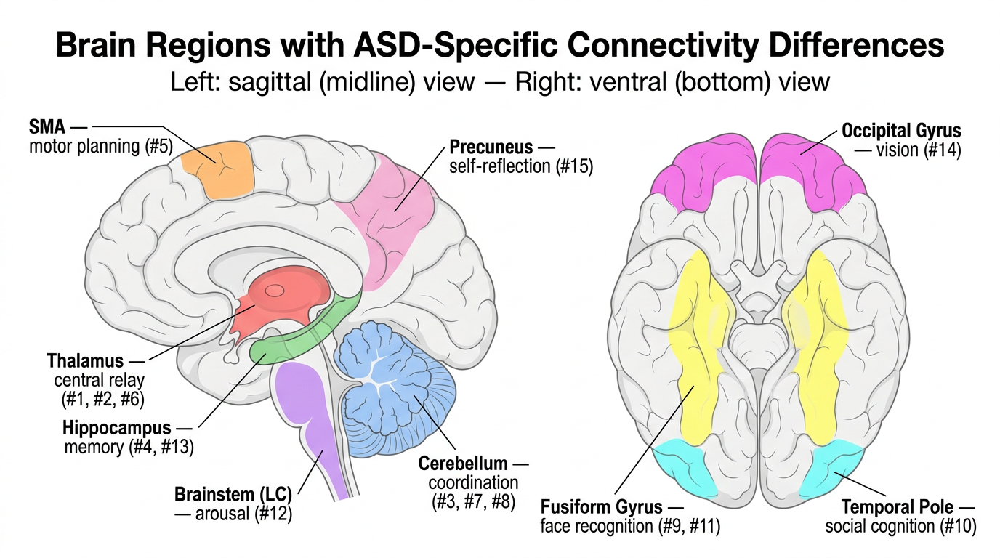

# 示例：识别自闭症谱系障碍中的脑连接差异

本示例将 `mnw` 分析流程应用于真实的神经影像数据，比较**自闭症谱系障碍（ASD）**个体与典型发育对照组之间的脑功能连接差异。目标是找出一组连接模式在两组之间存在系统性差异的脑区——这正是文献 [1] 中模型所设计恢复的低秩加稀疏结构信号。

## 非神经科学背景读者导读

脑连接网络是一个加权图：每个**节点**代表一个脑区，每条**边的权重**衡量两个脑区随时间共同激活的强度。当受试者在 MRI 扫描仪中静息（无任务）时，扫描仪会记录每个脑区的血氧信号时间序列。对每对脑区的时间序列计算 Pearson 相关系数，即可得到一个对称矩阵——**功能连接矩阵**——我们将其视为该受试者脑网络的加权邻接矩阵。

统计问题是：给定来自两组（对照组和 ASD 组）的一系列此类矩阵，我们能否（a）估计所有受试者共享的**低秩结构**，并（b）识别出在 ASD 组中连接模式发生系统性扰动的**稀疏节点集合**？这就是 `mnw` 流程 [1] 所解决的问题。

## 环境配置

```bash
pip install -r requirements.txt
pip install nilearn   # 用于下载 ABIDE 数据
```

## 数据

**数据来源。** 我们使用 [ABIDE Preprocessed](http://preprocessed-connectomes-project.org/abide/) 数据集 [3]，这是一个公开可用的静息态 fMRI 扫描数据集，包含来自多个站点的 ASD 个体及匹配对照组数据。

**脑区划分。** 大脑被划分为 **200 个感兴趣区域（ROI）**，使用 CC200 图谱 [2]——一种通过对体素级 fMRI 数据进行空间约束谱聚类所获得的数据驱动脑区划分方案。每个 ROI 是一组空间连续的体素。

**从扫描到矩阵。** 对于每位受试者，扫描仪在 200 个 ROI 中的每一个记录了 196 个时间点的测量值。我们计算所有 ROI 对之间的 200 × 200 Pearson 相关矩阵，将对角线设为零，作为该受试者的加权邻接矩阵。这样，每位受试者对应一个 200 × 200 的对称矩阵。

**样本。** 来自匹兹堡大学站点：
- **对照组**：5 名典型发育受试者
- **ASD 组**：5 名确诊 ASD 的个体

## 运行分析

```python
import numpy as np
from mnw import MultipleNetworkPipeline

# 为每位受试者计算 200x200 相关矩阵后：
pipeline = MultipleNetworkPipeline(
    rank=5,              # 共享低秩结构的秩
    support_size=15,     # 检测的扰动节点数量 (support size)
    support_method="glasso",
)

result = pipeline.fit(
    Y_control=Y_control,           # 对照组相关矩阵列表
    Y_treatment={"ASD": Y_asd},    # ASD 组相关矩阵列表
)

print(result.summary())
```

完整可运行脚本见 [`examples/run_abide.py`](run_abide.py)。

## 结果

### 流程输出

```
Input validated: n=200, 5 control, 5 treatment matrices.
Spectral init complete. Eigenvalues: [60.081 14.94  10.591  7.902  7.318]
Coherence filter: 200/200 rows retained, 0 high-coherence nodes excluded.
Recovering support for 'ASD' (m=15)...
  'ASD': 15 perturbed nodes found.
Debiased refinement complete.
```

**输出解读。** Spectral initialization 为共享连接结构找到了一个秩-5 近似。最大特征值（60.1）与其余特征值分离明显，表明存在一个强主成分。所有 200 个节点均通过了 coherence filter（没有节点对低秩估计产生不成比例的杠杆效应）。Support recovery 步骤选出了估计扰动矩阵中行范数最大的 15 个节点，最后通过 debiased refinement 步骤得到最终估计。

### ROI 到脑区的映射

CC200 图谱通过数据驱动聚类定义 ROI [2]，因此其脑区不带有解剖学名称。为了赋予结果神经科学解释，我们通过以下三个步骤将每个 ROI 映射到命名脑区：

1. **图谱来源。** 我们使用 [C-PAC 流程](https://github.com/FCP-INDI/C-PAC_templates)分发的 CC200 图谱（`CC200.nii.gz`），与 ABIDE 预处理所用图谱相同。该图谱是标准 MNI 空间中的三维体积，每个体素标记为 1--200。
2. **质心计算。** 对每个选出的 ROI，取其在图谱中所有同标签体素的空间坐标平均值，得到 MNI 空间中的一个 (x, y, z) 坐标点（MNI 是脑科学中的标准坐标系统）。
3. **解剖学查询。** 在该坐标处查询 **AAL3** 图谱 [4]。AAL3 将大脑划分为 166 个命名区域——包括精细的丘脑核团、小脑小叶和脑干结构——为每个 ROI 提供可读的解剖学标签。

脚本 [`examples/map_rois_to_regions.py`](map_rois_to_regions.py) 可自动完成上述映射。运行流程后，只需执行：

```bash
# 映射 results_abide/ 中保存的扰动节点
python examples/map_rois_to_regions.py

# 或直接指定 ROI 索引
python examples/map_rois_to_regions.py --rois 147 44 85 154 186
```

### 识别出的脑区

下图展示了被识别脑区在大脑中的位置。左图为矢状面（正中切面）视图，可见丘脑、海马体、小脑等深部结构；右图为腹侧（仰视）视图，展示大脑底面，可见梭状回和颞极。



流程识别出两组之间扰动最大的 **15 个节点**（脑区）。**||B\*||** 列报告的是估计扰动矩阵的逐行 L2 范数，衡量该节点的整体连接模式在 ASD 组和对照组之间的差异程度。数值越大表示组间差异越强。

| 排名 | ROI | 脑区（AAL3） | 侧别 | MNI (x, y, z) | \|\|B\*\|\| |
|------|-----|-------------|------|----------------|-------------|
| 1 | 147 | 丘脑（背内侧核，内侧部） | 右 | (2, −4, 5) | 3.74 |
| 2 | 44 | 丘脑（背内侧核，外侧部） | 左 | (−8, −18, 11) | 2.93 |
| 3 | 85 | 小脑（小叶 IX） | 右 | (9, −44, −37) | 2.74 |
| 4 | 154 | 海马体 | 右 | (21, −12, −16) | 2.71 |
| 5 | 186 | 辅助运动区 | 右 | (14, 22, 60) | 2.61 |
| 6 | 17 | 丘脑（前枕核） | 右 | (12, −20, 10) | 2.61 |
| 7 | 189 | 小脑（小叶 III） | 右 | (16, −35, −21) | 2.60 |
| 8 | 161 | 小脑（小叶 IV/V） | 左 | (−9, −44, −24) | 2.59 |
| 9 | 26 | 梭状回 | 左 | (−31, −5, −33) | 2.47 |
| 10 | 31 | 颞极（中部） | 右 | (44, 10, −36) | 2.46 |
| 11 | 197 | 梭状回 | 右 | (31, −1, −36) | 2.43 |
| 12 | 29 | 脑干（蓝斑区域） | 中线 | (3, −28, −36) | 2.43 |
| 13 | 86 | 海马体 | 右 | (38, −13, −26) | 2.38 |
| 14 | 141 | 枕上回 | 右 | (18, −90, 23) | 2.37 |
| 15 | 196 | 楔前叶 | 中线 | (−4, −53, 57) | 2.33 |

### 结果解读

为评估这些结果是否具有科学意义，我们将其与现有的 ASD 神经影像文献进行对比。对于任何变量选择方法，一个关键问题是：*被选出的变量是否对应已知的生物学机制？* 以下逐一总结每个被识别脑区与已有研究发现的关联。

**丘脑**（15 个节点中占 3 个，含前两名——排名 1、2、6）：

**丘脑**是大脑深部的中继站：几乎所有感觉和运动信号在传往大脑皮层的途中都要经过它。可以把它理解为大脑的"中央交换机"。背内侧核（排名 1-2）与前额叶皮层相连，参与执行功能、决策和社会认知。前枕核（排名 6）负责传递视觉和多感觉信息。丘脑节点表现出最强扰动，这与 Nair 等人 [5] 的发现一致——他们联合使用 fMRI 和扩散成像证明 ASD 儿童存在丘脑-皮层连接损伤，并指出丘脑中继功能障碍可能是许多皮层水平 ASD 症状的上游原因。

**小脑**（3 个节点——排名 3、7、8）：

**小脑**（"小的大脑"）位于颅骨后下方。传统上与运动协调和平衡相关，现已知它通过与大脑皮层的环路参与认知和社会功能。小脑异常是 ASD 中最早发现且最具可重复性的神经解剖学结果之一，可追溯至 Courchesne 等人 [6] 的里程碑式报告。D'Mello 和 Stoodley [7] 综述了特定小脑小叶如何分别映射到运动、认知和社会回路——这些都是 ASD 中受影响的功能领域。

**海马体**（2 个节点——排名 4、13）：

**海马体**位于颞叶内侧褶皱处，以其在形成新记忆中的作用而闻名，同时也支持空间导航和社会记忆（如记住面孔和过去的社交互动）。Cooper 等人 [10] 发现 ASD 成人在记忆提取过程中海马体的功能连接减弱，将海马网络功能障碍与该障碍中观察到的情景记忆困难联系起来。

**梭状回**（2 个节点——排名 9、11）：

**梭状回**位于大脑底面，包含"梭状面孔区"（FFA）——一个在人们观看面孔时强烈激活的区域。FFA 在面孔加工过程中的激活和连接减弱是 ASD 中最经充分验证的神经影像学发现之一 [8]，被认为是该障碍中面孔识别和社会感知困难的基础。流程检测到了双侧（左右）梭状回扰动。

**颞极**（1 个节点——排名 10）：

**颞极**位于颞叶最前端，参与社会认知——特别是"心理理论"，即推断他人想法或感受的能力 [9]。颞极功能障碍与 ASD 中的社交沟通困难一直存在密切关联。

**辅助运动区**（1 个节点——排名 5）：

**辅助运动区（SMA）**位于大脑顶部靠近中线处，负责运动规划和序列组织。运动困难在自闭症谱系中普遍存在：一项涵盖 83 项研究的荟萃分析发现，ASD 群体的运动协调缺陷效应量很大（d = 1.20）[11]。

**脑干**（1 个节点——排名 12）：

该脑区与**蓝斑（LC）**重叠。蓝斑是脑干中的一个小型核团，产生去甲肾上腺素并调节觉醒和注意力。ASD 儿童中已观察到异常的蓝斑活动——表现为静息瞳孔直径增大和注意脱离困难 [12]，提示存在低层次觉醒调节异常，可能进而影响高阶注意功能。

**视觉皮层与默认模式网络**（2 个节点——排名 14、15）：

**枕上回**（排名 14）属于视觉加工层级，与 ASD 中常报告的非典型视觉感知一致。**楔前叶**（排名 15）是"默认模式网络"（DMN）的核心枢纽——DMN 是一组在静息和自我参照思维时激活的脑区。Assaf 等人 [13] 发现，ASD 中楔前叶与 DMN 内部连接的减弱与社交和沟通症状的严重程度呈负相关。

### 总结

在所有 15 个被选出的节点中，每个被识别的脑区都有独立的文献支持其与 ASD 的关联。这些发现涵盖皮层下中继结构（丘脑、脑干）、记忆系统（海马体）、社会感知区域（梭状回、颞极）、运动协调区域（小脑、辅助运动区）以及高阶关联网络（楔前叶/DMN、视觉皮层）。这种与已有神经科学发现的高度吻合表明，`mnw` 流程恢复的是具有科学意义的信号而非噪声——即使在仅有 5 + 5 名受试者的小样本中亦是如此。

### 保存的输出文件

流程将所有结果保存至输出目录：

```
results_abide/
  M_hat.npy              # 200x200 估计的共享连接结构 (M*)
  U_hat.npy              # M* 的主特征向量 (200 x 5)
  Lambda_hat.npy         # M* 的主特征值 (5,)
  B_hat_ASD.npy          # 200x200 估计的扰动矩阵 (B*)
  perturbed_nodes.json   # 15 个选出节点的索引
  summary.txt            # 可读摘要
```

可加载用于进一步分析：

```python
from mnw import NetworkAnalysisResult
result = NetworkAnalysisResult.load("results_abide/")
result.plot_shared_structure()
result.plot_perturbations(network_id="ASD")
```

## 注意事项

本演示仅使用了来自单一采集站点的小样本（5 + 5 名受试者），目的是说明方法的用法。正式的研究应使用更大的样本量，探索 rank 和 support size 等超参数的敏感性，并结合交叉验证或置换检验以进行严格的统计推断。

## 参考文献

[1] Yan & Levin (2025). [Estimating Multiple Weighted Networks with Node-Sparse Differences and Shared Low-Rank Structure.](https://arxiv.org/abs/2506.15915) arXiv:2506.15915.

[2] Craddock et al. (2012). A whole brain fMRI atlas generated via spatially constrained spectral clustering. *Human Brain Mapping*, 33, 1914--1928.

[3] Di Martino et al. (2014). The Autism Brain Imaging Data Exchange: towards a large-scale evaluation of the intrinsic brain architecture in autism. *Molecular Psychiatry*, 19, 659--667.

[4] Rolls et al. (2020). Automated anatomical labelling atlas 3. *NeuroImage*, 206, 116189.

[5] Nair et al. (2013). Impaired thalamocortical connectivity in autism spectrum disorder: a study of functional and anatomical connectivity. *Brain*, 136(6), 1942--1955.

[6] Courchesne et al. (1988). Hypoplasia of cerebellar vermal lobules VI and VII in autism. *New England Journal of Medicine*, 318(21), 1349--1354.

[7] D'Mello & Stoodley (2015). Cerebro-cerebellar circuits in autism spectrum disorder. *Frontiers in Neuroscience*, 9, 408.

[8] Schultz (2005). Developmental deficits in social perception in autism: the role of the amygdala and fusiform face area. *International Journal of Developmental Neuroscience*, 23(2--3), 125--141.

[9] Olson et al. (2007). The enigmatic temporal pole: a review of findings on social and emotional processing. *Neuropsychologia*, 45(11), 2515--2524.

[10] Cooper et al. (2017). Reduced hippocampal functional connectivity during episodic memory retrieval in autism. *Cerebral Cortex*, 27(2), 888--902.

[11] Fournier et al. (2010). Motor coordination in autism spectrum disorders: a synthesis and meta-analysis. *Journal of Autism and Developmental Disorders*, 40, 1227--1240.

[12] Bast et al. (2021). Attentional disengagement and the locus coeruleus--norepinephrine system in children with autism spectrum disorder. *Frontiers in Integrative Neuroscience*, 15, 716447.

[13] Assaf et al. (2010). Abnormal functional connectivity of default mode sub-networks in autism spectrum disorder patients. *NeuroImage*, 53, 247--256.
